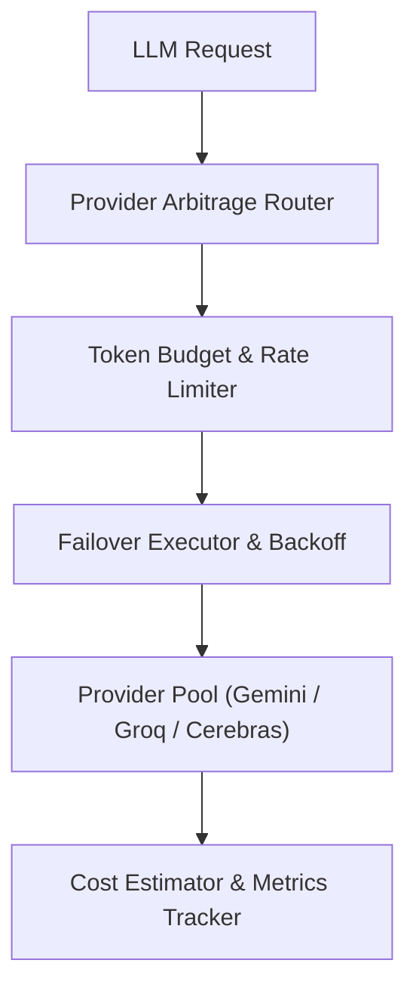

# Architecture: Ayeixa FuelLite

## Overview
FuelLite provides precise cost accounting and dynamic provider failover for high-throughput AI agent clusters.

## System Topology

```mermaid
flowchart TD
    Client["LLM Request"] --> Router["Provider Arbitrage Router"]
    Router --> Budget["Token Budget & Rate Limiter"]
    Budget --> Failover["Failover Executor & Backoff"]
    Failover --> Providers["Provider Pool (Gemini / Groq / Cerebras)"]
    Providers --> Estimator["Cost Estimator & Metrics Tracker"]
```
